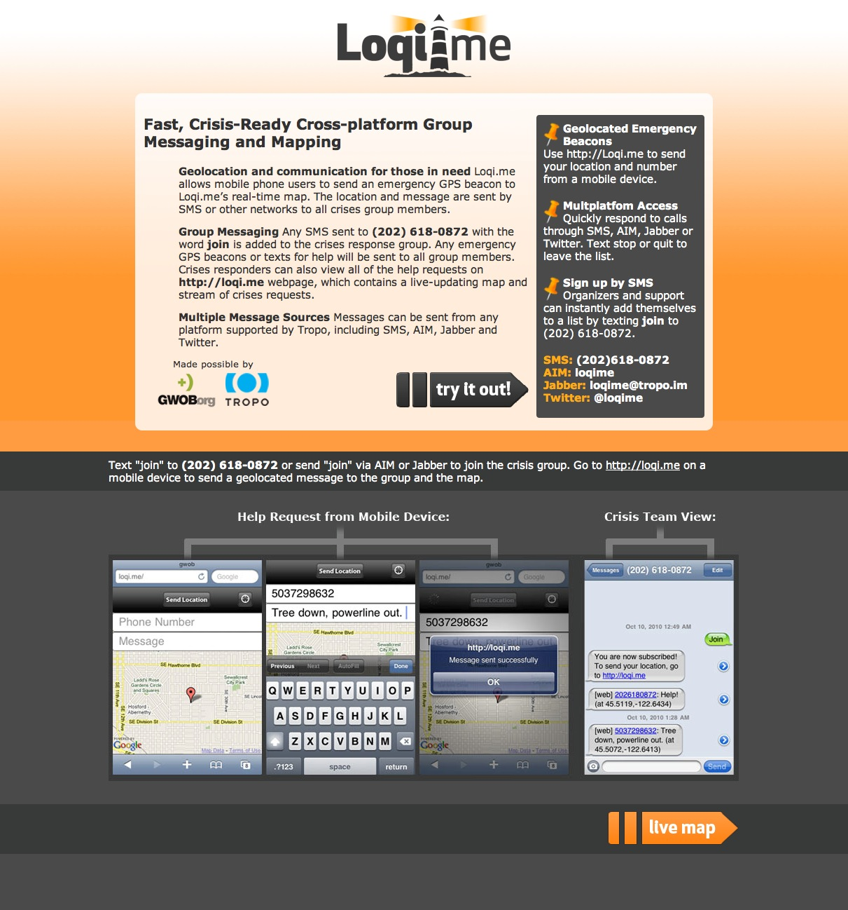
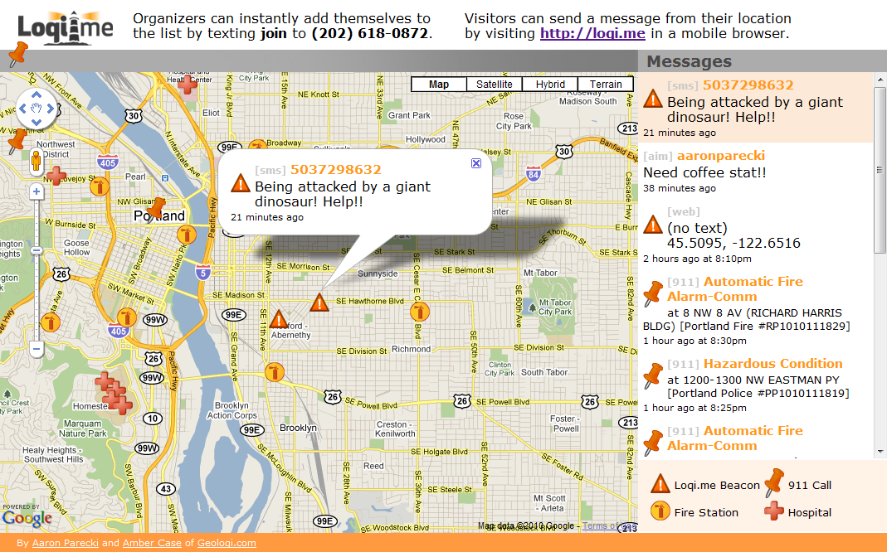

ABOUT
=====

Loqi.me allows mobile users to send an emergency GPS beacon to a real-time map. Crises responders 
can view all of the help requests on the webpage, along with hospitals and fire stations, 
real-time 911 calls related to natural disasters.

Ground teams can easily use Loqi.me on their mobile phones to send notices of supplies and 
terrain reports in real time. Remote helpers can easily see the whole picture on the website's 
real-time map, handle help and information requests, and send messages to the network.

Loqi.me supports subscription to group messages via SMS, AIM, Jabber and Twitter. No application 
installation is required. Location beacons can be sent simply by going to http://loqi.me on a mobile phone.

This application is a resource for citizens, medical teams and governments before, during and after disasters.

LICENSE
=======

See LICENSE.

Copyright (c) 2010, Geoloqi.com
All rights reserved.

Source code is available under the GPL v2.0 license
http://creativecommons.org/licenses/GPL/2.0/

You may contact us to discuss alternative licensing arrangements. info@geoloqi.com

You must conspicuously and appropriately publish on each copy distributed an appropriate 
copyright notice and disclaimer of warranty and keep intact all the notices that refer 
to this License and to the absence of any warranty; and give any other recipients of the 
Program a copy of the GNU General Public License along with the Program. Any translation 
of the GNU General Public License must be accompanied by the GNU General Public License.

If you modify your copy or copies of the program or any portion of it, or develop a program 
based upon it, you may distribute the resulting work provided you do so under the GNU General 
Public License. Any translation of the GNU General Public License must be accompanied by the 
GNU General Public License.

If you copy or distribute the program, you must accompany it with the complete corresponding 
machine-readable source code or with a written offer, valid for at least three years, to 
furnish the complete corresponding machine-readable source code.

